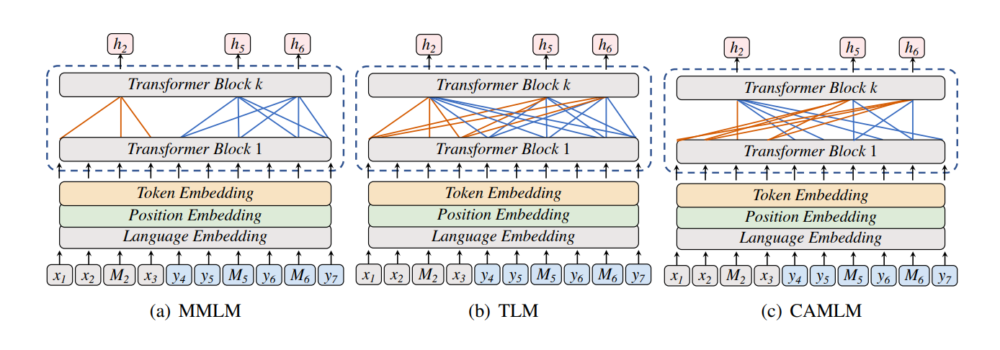
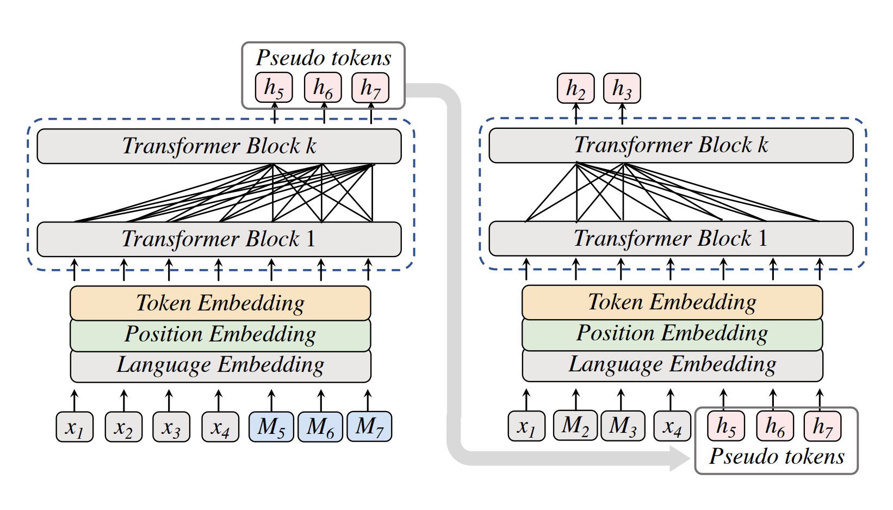
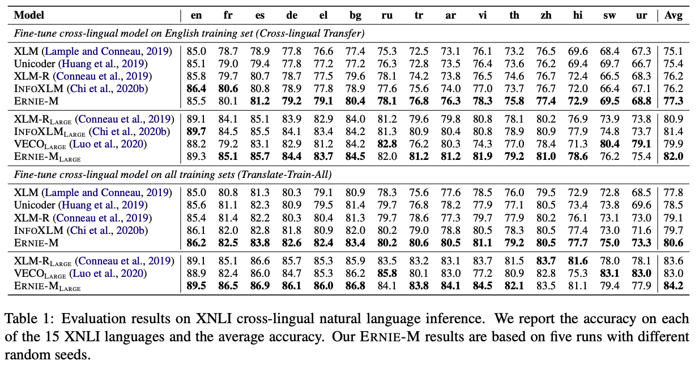
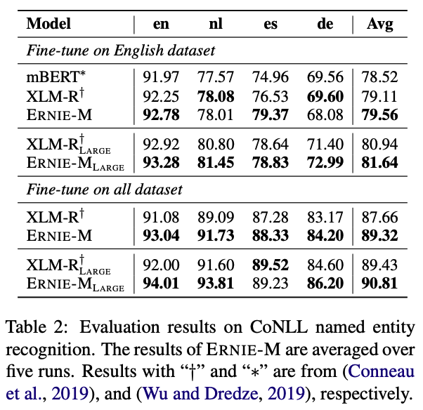
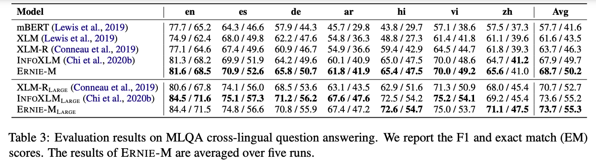
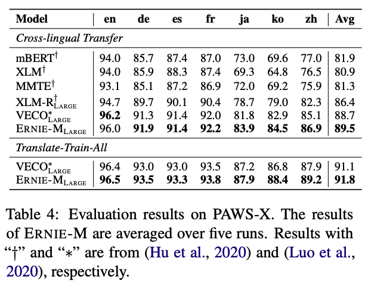
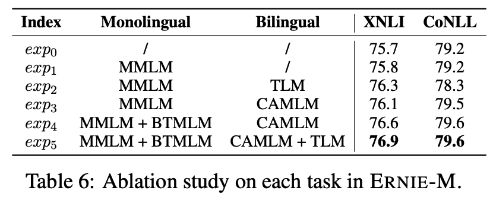

Ernie-M: An improved multilingual language model that uses knowledge learned from monolingual corpora to perform cross-lingual tasks better.

Reading Time: About 10 minutes.

<!-- more -->

Paper：<https://aclanthology.org/2021.emnlp-main.3/>

Code: <https://github.com/PaddlePaddle/ERNIE/tree/repro/ernie-m>

Demo: <https://huggingface.co/docs/transformers/v4.35.1/en/model_doc/ernie_m#overview>

## Introduction

<p align="center"></p>

In the realm of natural language processing, a field reliant on copious data, groundbreaking advancements primarily emerge in high-resource languages like English and Chinese, sidelining thousands of low-resource languages. While the conventional approach involves training individual models for each language, recent years have witnessed substantial progress in multilingual model research. This avenue presents a vision of a future where a single model comprehends all languages, fostering seamless communication and information exchange across diverse linguistic backgrounds.

Recent research highlights the impressive performance of pre-trained cross-lingual models in downstream tasks, leveraging extensive monolingual and parallel corpora. However, the efficacy of these methods is often hampered by the limited size of parallel corpora, particularly for low-resource languages [1].

This paper introduces ERNIE-M, a novel multilingual model proficient in understanding 96 languages, coupled with an innovative training method enhancing cross-lingual transferability, even in data-sparse languages. ERNIE-M refers to an enhanced version of the ERNIE (Enhanced Representation through kNowledge Integration) model. This approach encourages the model to align representations across multiple languages with monolingual corpora, mitigating the performance constraints posed by the size of parallel corpora. Experimental results demonstrate ERNIE-M's superiority over existing cross-lingual models, establishing new benchmarks across various cross-lingual downstream tasks.

## Background

Contemporary smart systems like search engines, chatbots, and smart speakers rely heavily on extensive labeled data in a single language. Unfortunately, the vast majority of the 6,500 spoken languages globally lack sufficient data, posing a significant challenge for machines to comprehend them, which in turn limits the accessibility of AI.

Multilingual language models, proficient in understanding and generating text across multiple languages, can be categorized into two main types: discriminative (e.g., mBERT, XLM) and generative (e.g., MASS, mT5). While these models exhibit promise, they encounter limitations in effectively capturing the subtleties of diverse languages. Recent research emphasizes unified multilingual models, showcasing that pretraining cross-lingual language models markedly enhances their performance in cross-lingual natural language processing tasks. These models acquire a language-agnostic representation shared across multiple languages, facilitating transfer learning from well-resourced languages to those with limited resources.

The conventional effective method involves training a model on various monolingual datasets to grasp semantic representation and align languages on parallel corpora. However, limited sizes of parallel corpora hinder the model's performance, especially for low-resource languages where parallel data is scarce, making the task more difficult.

To address these challenges, ERNIE-M introduces innovative approaches inspired by back translation and non-autoregressive neural machine translation. Back translation, known for improving translation performance using parallel data, serves as inspiration for ERNIE-M to enhance its comprehension of different languages. The goal is to overcome previous model limitations and enhance performance in handling diverse languages.

## ERNIE-M Methodology

Recent research findings highlight the remarkable success of pre-trained cross-lingual models in excelling at downstream cross-lingual tasks. This achievement stems from the extensive learning acquired from both monolingual and parallel corpora.

ERNIE-M introduces a key concept: leveraging the transferability gained from parallel corpora to enrich the model's understanding of large-scale monolingual corpora. This strategy aims to enhance the multilingual semantic representation by fostering the learning of semantic alignments between different languages. The authors implement this by generating pseudo-parallel sentence pairs on a monolingual corpus.

Based on this idea, the authors propose two pre-training objectives, cross-attention masked language modeling (CAMLM) and back-translation masked language modeling (BTMLM). CAMLM focuses on aligning the cross-lingual semantic representation on parallel corpora. Subsequently, the transferability acquired from parallel corpora is harnessed to elevate the multilingual representation. Specifically, ERNIE-M is trained by using BTMLM, enabling the model to align the semantics of multiple languages from monolingual corpora and enhance its overall multilingual representation.


### Cross-attention Masked Language Modeling (CAMLM)

In the first stage of this training process, Cross-attention Masked Language Modeling (CAMLM), the aim is to align cross-lingual semantic representation using a small parallel corpus. Unlike other pre-training methods such as Multilingual Masked Language Modeling (MMLM)[2] and Translation Language Modeling (TLM)[3], which focus on learning a shared language-invariant feature space among multiple languages, CAMLM takes a distinct approach. MMLM implicitly models each language's semantic representation in a unified feature space, while TLM, an extension of MMLM, captures semantic alignment by learning parallel sentence pairs simultaneously. However, these methods face constraints due to the limited size of available parallel corpora, especially in low-resource languages.

In contrast, in CAMLM, the multilingual semantic representation is learned by restoring the MASK token in input sentences. When the model restores the MASK token in the source sentence, it can only rely on the semantics of the target sentence. This requires the model to learn how to represent the source language with the semantics of the target sentence, effectively aligning the semantics of multiple languages.

Unlike TLM, where semantic alignment relies on both source and target sentences, CAMLM only relies on one side of the sentence to restore the MASK token. 
In TLM, predicting the MASK token is based on the input sentence pair. In CAMLM, the model predicts the MASK token solely based on the sentence of its corresponding parallel sentence and the MASK symbol of this sentence, providing essential position and language information. This unique aspect of CAMLM is advantageous because it avoids information leakage, preventing the model from attending to a pair of input sentences simultaneously. This feature enables the subsequent learning of Back-translation Masked Language Modeling (BTMLM), as illustrated in the figure below.

<p align="center"></p>

In this figure, the input sentences in sub-figure (a) are monolingual sentences; x and y represent monolingual input sentences in different languages. The input sentences in sub-figures (b) and (c) are parallel sentences; x and y denote the source and target sentences of the parallel sentences, respectively. h indicates the token predicted by the model.

Here, a parallel sentence pair is denoted as `<source sentence, target sentence>`. For example, given a parallel CH-EN sentence pair input as 
``` <明天会 [MASK][MASK] 吗，Will it be sunny tomorrow> ```, the model has to uncover the MASK token `<天晴>` in the source sentence by solely relying on the meaning of the target sentence, thus learning the semantic representation between the two languages.


### Back-translation Masked Language Modeling (BTMLM)

The second stage proposed by the authors is Back-translation Masked Language Modeling (BTMLM), to further train the model, building upon the transferability gained through CAMLM. BTMLM involves generating pseudo-parallel sentences from monolingual sentences, and these generated sentences are then utilized as input for the model to align cross-lingual semantics.

The learning process for the BTMLM is divided into two stages. 

1. ***Stage 1*** focuses on generating pseudo-parallel tokens from monolingual corpora. Specifically, the authors insert placeholder MASK tokens at the end of monolingual sentences to indicate the location and language for generation. The model then generates corresponding parallel language tokens based on the original monolingual sentence and the position of the pseudo-token. This process allows the generation of tokens from another language in the monolingual sentence, contributing to the learning of cross-lingual semantic alignment. During the pseudo-token generation, the model can only attend to the source sentence and the placeholder MASK tokens, indicating the language and position to predict, using language embeddings and position embeddings.

2. ***Stage 2*** utilizes the pseudo-tokens generated in Stage 1 to learn cross-lingual semantics alignment. In the training process of Stage 2, the model's input is the concatenation of monolingual sentences and generated pseudo-parallel tokens. The learning objective is to restore the MASK tokens based on the original sentences and generated pseudo-parallel tokens. This unique approach allows the model to explicitly learn the alignment of cross-lingual semantic representation from monolingual sentences.  

In summary, BTMLM involves predicting part of the tokens in input monolingual sentences into tokens of another language. The predicted tokens and the input sentence are then concatenated as pseudo-parallel sentences to train the model. This two-stage process is illustrated in the figure below, with the left figure representing the first stage of BTMLM, predicting pseudo-tokens, and the right figure representing the second stage, making predictions based on the predicted pseudo-tokens and original sentences.

<p align="center"></p>

In ERNIE-M, the authors use MMLM and TLM by default because of the strong performance shown in previous work [2][3]. The authors combine MMLM, TLM with CAMLM, BTMLM to train ERNIE-M. The generated pairs from this comprehensive approach serve as input for the model, further aligning cross-lingual semantics and  enhancing the multilingual representation. This way, the model can learn sentence alignment with only monolingual corpora and overcome the constraint of the parallel corpus size while improving the model performance.


## Experiments and Results
The authors examine five cross-lingual evaluation benchmarks, encompassing diverse linguistic tasks. These include XNLI, evaluating cross-lingual natural language inference; MLQA, designed for cross-lingual question answering; CoNLL, specializing in cross-lingual named entity recognition; PAWS-X, tailored for cross-lingual paraphrase identification; and Tatoeba, honing in on cross-lingual retrieval scenarios. These benchmarks collectively serve as a comprehensive framework for evaluating the efficacy of models in a range of cross-lingual applications.

In the XNLI task, ERNIE-M showcased excellence in both cross-lingual transfer and translate-train-all settings. Outperforming baseline models like XLM, Unicoder, XLM-R, INFOXLM, and VECO, ERNIE-M achieved an average accuracy of 77.3 in cross-lingual transfer and 80.6 in translate-train-all. The larger variant, ERNIE-MLARGE, set a new state-of-the-art with 82.0 accuracy in cross-lingual transfer and 84.2 in translate-train-all, surpassing XLM-RLARGE. The results are summarized in Table 1.

<p align="center"></p>

For NER tasks on CoNLL-2002 and CoNLL-2003, ERNIE-M outshone XLM-R, establishing itself as a state-of-the-art model. Particularly noteworthy was its exceptional performance in low-resource languages, where ERNIE-M surpassed the state-of-the-art in Dutch and German.

<p align="center"></p>

In the MLQA task for Question Answering, ERNIE-M surpassed various baseline models, achieving a state-of-the-art score with significantly higher F1 and extract match (EM) scores compared to INFOXLM.

<p align="center"></p>

The cross-lingual Paraphrase Identification task, evaluated on the PAWS-X dataset, further demonstrated ERNIE-M's prowess. It outperformed baseline models in both cross-lingual transfer and translate-train-all settings, showcasing its accuracy and versatility across different languages.

<p align="center"></p>


Lastly, in the retrieval task using the Tatoeba dataset, ERNIE-M exhibited substantial improvement in accuracy across all languages following fine-tuning with the hardest negative binary cross-entropy loss.

<p align="center"></p>


In essence, ERNIE-M emerged as a consistently superior model, surpassing baseline models across a spectrum of cross-lingual tasks. Its effectiveness and robust performance underscore its utility in natural language understanding across diverse linguistic contexts.


### Ablation Study
In the ablation study, a series of experiments (exp0 to exp5) were conducted to understand how aligning semantic representations impacts ERNIE-M's training.

- **exp0:** This served as the baseline, involving direct fine-tuning of the XLM-R model on the XNLI and CoNLL tasks.

- **exp1 (MMLM):** ERNIE-M was trained solely on the Masked Language Model (MMLM) using the monolingual corpus to measure the baseline performance gain.

- **exp2 (MMLM + TLM):** This experiment combined MMLM on the monolingual corpus with the Translation Language Model (TLM) on the bilingual corpus to assess the impact of translation-based objectives.

- **exp3 (MMLM + CAMLM):** Integrating MMLM on the monolingual corpus with the Cross-lingual Alignment Model (CAMLM) on the bilingual corpus aimed to evaluate the influence of cross-lingual alignment.

- **exp4 (MMLM + BTMLM + CAMLM):** This experiment incorporated MMLM and Back Translation MMLM (BTMLM) on the monolingual corpus with CAMLM on the bilingual corpus, aiming to combine various training objectives.

- **exp5 (Full Strategy of ERNIE-M):** This represented the complete ERNIE-M strategy, combining multiple training objectives for comprehensive cross-lingual training.


<p align="center"></p>


Comparisons between these experiments helped discern the impact of different training objectives on cross-lingual semantic alignment and downstream task performance. Notably, the study revealed that certain combinations, such as BTMLM and CAMLM, proved more effective in capturing cross-lingual semantics, leading to improved performance on tasks like XNLI and CoNLL. The experiments highlighted the importance of selecting appropriate training objectives for achieving superior cross-lingual representation alignment and task-specific outcomes.

### ERNIE-M Re-implmentation
We re-implemented both ERNIE and ERNIE-LARGE using Hugging Face and obtained the following results. The evaluations were conducted for the XNLI task across 15 languages.


| Model                  | ar     | bg      | de     | el    | en      | es      | fr     | hi    | ru      | sw      | th    | tr      | ur    | vi         | zh      | Average |
|------------------------|--------|---------|--------|-------|---------|---------|--------|-------|---------|---------|------|---------|------|------------|---------|---------|
| ERNIE-M Base  | 0.7764 | 0.8122  | 0.8038 | 0.7966| 0.8537  | 0.8138  | 0.8028 | 0.7445| 0.7842  | 0.7108  | 0.7651| 0.7756  | 0.7172| 0.7922     | 0.7487  | 0.7798  |
| ERNIE-M Large | 0.8178 | 0.8533  | 0.8395 | 0.8365| 0.8818  | 0.8547  | 0.8489 | 0.7994| 0.8295  | 0.7517  | 0.8090| 0.8178  | 0.7601| 0.8263     | 0.7986  | 0.8217  |

The obtained results align with the anticipated outcomes as documented in the Hugging Face repository, available [here](https://huggingface.co/MoritzLaurer/ernie-m-large-mnli-xnli).

For the implementation details, you can refer to the corresponding Colab notebook, accessible [here](https://colab.research.google.com/drive/1Mqwyogeq7CupZyILh7a7sFv3Zx2nwngc?usp=sharing).


## Conclusion

To address the limitation imposed by the size of parallel corpora on the performance of cross-lingual models, this paper introduces a novel cross-lingual model, ERNIE-M, trained on both monolingual and parallel corpora. ERNIE-M makes a significant contribution by introducing two key training objectives. The first objective aims to enhance the multilingual representation on parallel corpora through the application of Cross-attention Masked Language Modeling (CAMLM). The second objective focuses on facilitating the alignment of cross-lingual semantic representations from a monolingual corpus using Back-translation Masked Language Modeling (BTMLM). Experimental results demonstrate that ERNIE-M achieves state-of-the-art (SoTA) results across various downstream tasks on datasets such as XNLI, MLQA, CoNLL, PAWS-X, and Tatoeba.

## References

[1] Xuan Ouyang, Shuohuan Wang, Chao Pang, Yu Sun, Hao Tian, Hua Wu, and Haifeng Wang. 2021. ERNIE-M: Enhanced Multilingual Representation by Aligning Cross-lingual Semantics with Monolingual Corpora. In Proceedings of the 2021 Conference on Empirical Methods in Natural Language Processing, pages 27–38, Online and Punta Cana, Dominican Republic. Association for Computational Linguistics.

[2] Jacob Devlin, Ming-Wei Chang, Kenton Lee, and Kristina Toutanova. 2018. Bert: Pre-training of deep bidirectional transformers for language understanding. arXiv preprint arXiv:1810.04805.

[3] Alexis Conneau, Guillaume Lample, Ruty Rinott, Adina Williams, Samuel R Bowman, Holger Schwenk, and Veselin Stoyanov. 2018. Xnli: Evaluating cross-lingual sentence representations. arXiv preprint arXiv:1809.05053.
